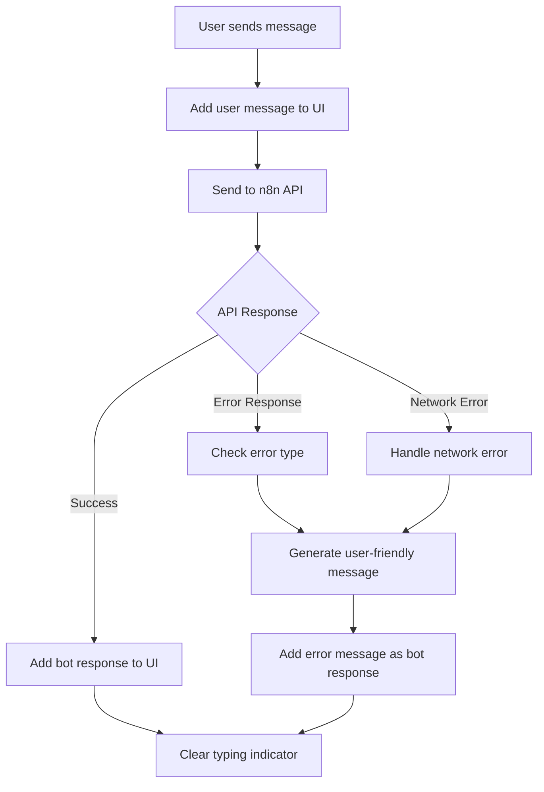

# Enhanced Error Handling for n8n Chat Integration

The chat system now includes comprehensive error handling with user-friendly messages for different scenarios.

## Error Handling Features

### 1. Specific Error Messages

The system now detects different types of errors and provides appropriate user-friendly messages:

#### **Unauthorized Access (401)**
- **Triggers when:** API returns unauthorized error
- **User sees:** "You don't have permission to access this chat. Please check your credentials."
- **Example error text:** "Unauthorized", "401"

#### **Network Connection Issues**
- **Triggers when:** Network or connection problems
- **User sees:** "Connection failed. Please check your internet connection and try again."
- **Example error text:** "network", "connection", "fetch"

#### **Request Timeout**
- **Triggers when:** Request takes too long
- **User sees:** "Request timed out. The server might be busy, please try again in a moment."
- **Example error text:** "timeout"

#### **Server Errors (500)**
- **Triggers when:** Server-side issues
- **User sees:** "The server is experiencing issues. Please try again later."
- **Example error text:** "500", "server"

#### **Service Unavailable (404)**
- **Triggers when:** Service not found
- **User sees:** "The chat service is currently unavailable. Please contact support."
- **Example error text:** "404"

#### **Generic Errors**
- **Triggers when:** Any other unknown error
- **User sees:** "Something went wrong. Please try again."

### 2. Message State Management

After each interaction, the system properly updates the message list:

```typescript
// User message is always added first
const userMessage = {
  content: messageText,
  sender: 'user',
  timestamp: new Date()
};

// Then either bot response or error message
if (result.success) {
  const botMessage = {
    content: result.message.content,
    sender: 'bot',
    timestamp: new Date(result.message.created_at)
  };
  // Both messages added to state
} else {
  const errorMessage = {
    content: userFriendlyErrorMessage,
    sender: 'bot',
    timestamp: new Date()
  };
  // User message + error response added to state
}
```

### 3. Developer Debugging

While users see friendly messages, developers get detailed error information:

```typescript
// Actual error logged for debugging
console.error('Chat API Error:', actualErrorText);
```

This allows for:
- User-friendly error messages in the UI
- Detailed technical errors in the console for debugging
- Proper error tracking and monitoring

### 4. Error Handling Flow



### 5. Implementation Details

The error handling is implemented in `client/contexts/ChatContext.tsx`:

- **Case-insensitive error detection** using `.toLowerCase().includes()`
- **Fallback messages** for unknown error types
- **Proper message state management** ensuring user messages are always saved
- **TypeScript type safety** with proper error type narrowing

### 6. Testing Error Scenarios

You can test different error scenarios by:

1. **Network errors:** Disconnect internet during message send
2. **Server errors:** Modify the API endpoint to return 500 errors
3. **Auth errors:** Use an invalid API token
4. **Timeout errors:** Simulate slow network conditions

### 7. Customization

To customize error messages, edit the error handling logic in `client/contexts/ChatContext.tsx`:

```typescript
if (errorText.toLowerCase().includes('your-custom-error')) {
  userFriendlyMessage = 'Your custom user-friendly message';
}
```

This enhanced error handling ensures users always receive helpful feedback while maintaining a professional chat experience.
